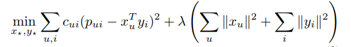

# collaborativefilteringimplicit
This project contains collaborative filtering technique to build recommendations from implicit feedback. For implementing this technique we require two major parameters viz. confidence and preference. Confidence is associated with the frequency of actions whereas preference is binary. 
For example: If a user clicks on any item, the preference is 1, otherwise it is zero. Confidence is directly proportional to the number of times a user clicks the same item. High number clicks means higher confidence value.

Stochastic gradient descent is used to minimize the SSE. Regularization is also added to avoid the overfitting. 

Optimization function: 

Reference: 
Y. Hu, Y. Koren and C. Volinsky, "Collaborative Filtering for Implicit Feedback Datasets," 2008 Eighth IEEE International Conference on Data Mining, Pisa, 2008, pp. 263-272. doi: 10.1109/ICDM.2008.22 URL: http://ieeexplore.ieee.org/stamp/stamp.jsp?tp=&arnumber=4781121&isnumber=4781078
